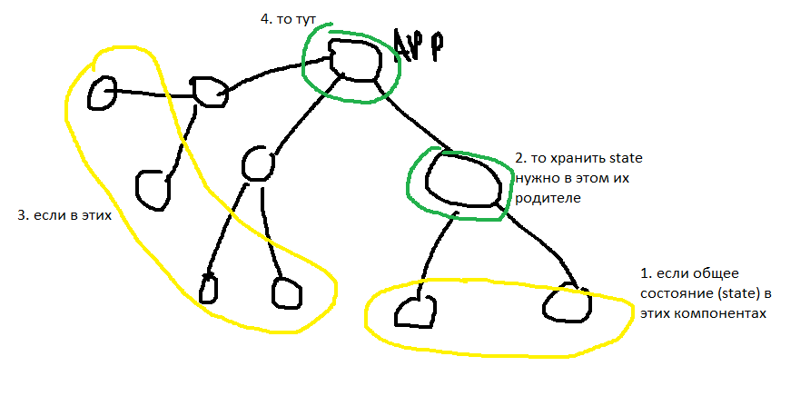

# Меню:

## 1.Counter

счетчик, увеличения/уменьшения числа (изменение state);

правльная последовательность класса

## 2.Dropdown - выпадающее меню

## 3.ColorPicker - выбор цвета,

добавить 2 класса(--isActive);

деструктуризация

## 4.Реэкспорт

создания index.js в папке компонента и там export, чтобы путь import-a был чище
в App.jsx

## 5.где хранить State?

если нескольким компонентам нужно общее состояние (state), то хранить нужно в
ближайшем предке

## 6.ToDoList

список дел, удаление, подсчет общего кол-ва, а также выполненых

## 7.Form

классическая форма, поднятие состояния, уникальные ID с помощью пакета
shortid(npm)

множественные радиокнопки

## 8. файл .env

работает как "сократитель путей к папкам", где обезательно вписать
SASS-PATH=src(путь к папке с стилями), и в импорте вместо
'../../styles/styles.scss' будет 'styles/styles.scss'

## 9. пакет classnames(npm) npm i classnames

удобная утилита для добавления, изменения класов
